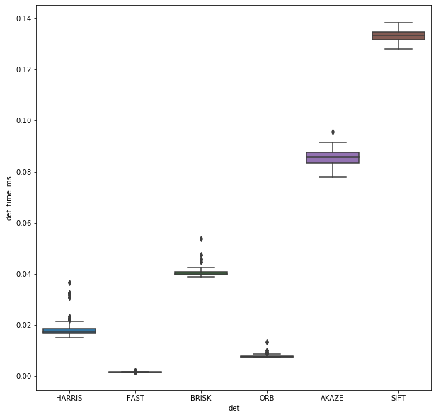
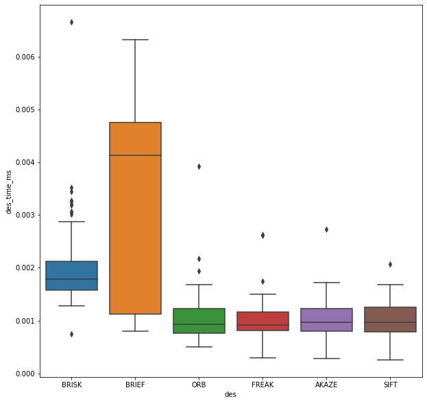
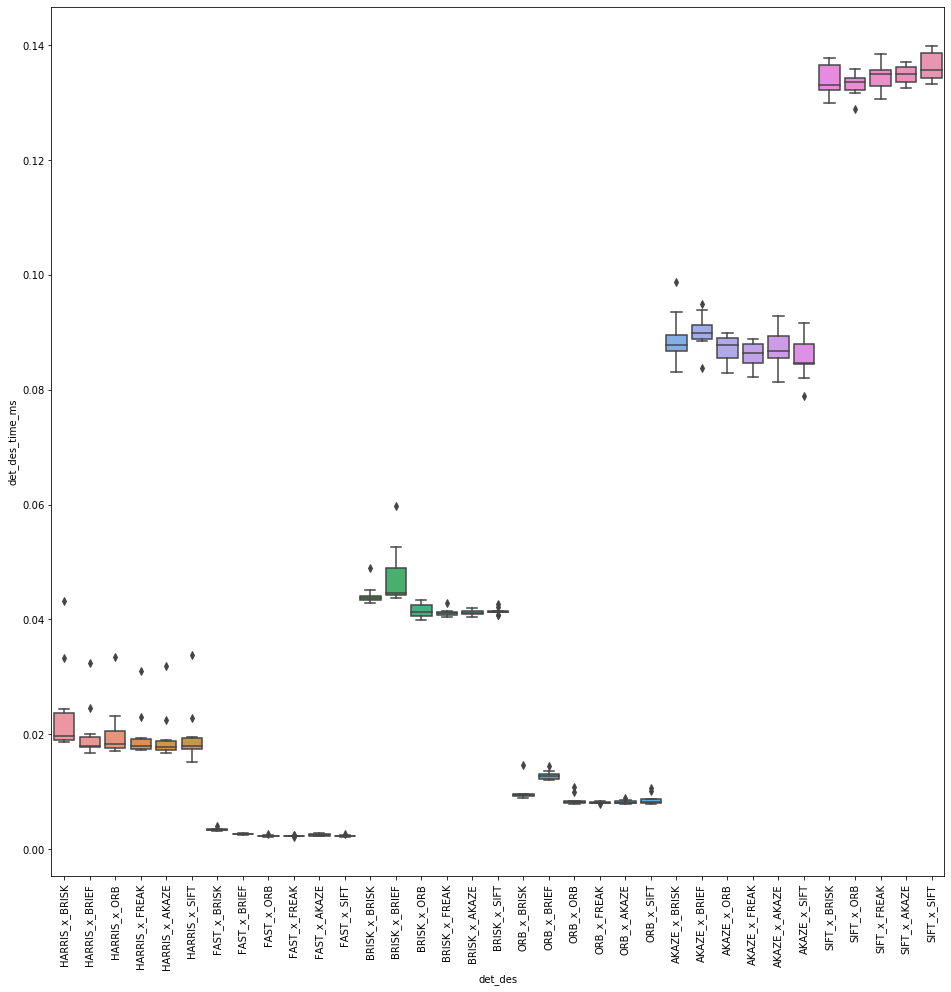
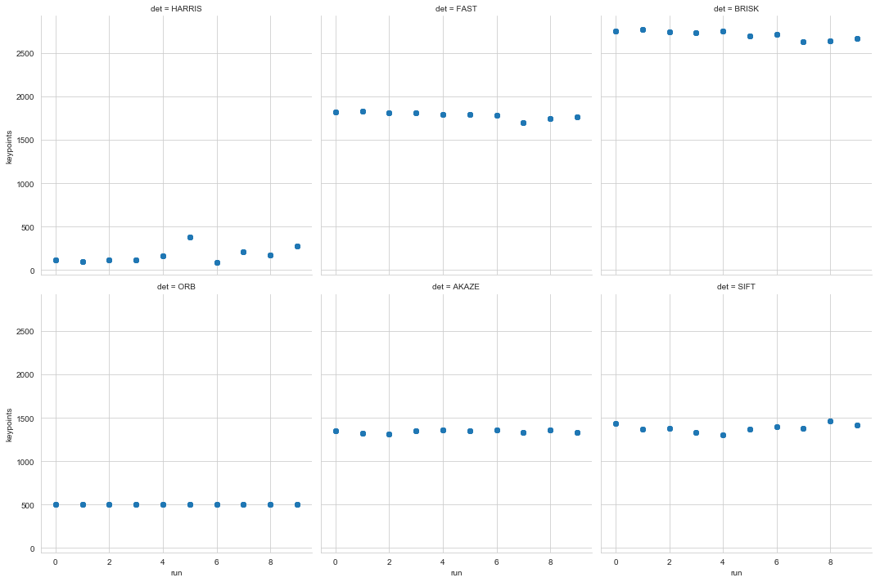
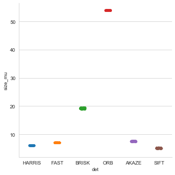

**Camera Based 2D Feature Tracking (Mid-Term)**

*Saminda Abeyruwan*

We present herewith the analysis of the time it takes for keypoint detection and descriptor extraction.

Our dataset is available in *stats_output.csv* file. We have used HARRIS, FAST, BRISK, ORB, AKAZE, and SIFT detectors
and BRIEF, ORB, FREAK, AKAZE and SIFT descriptors. The matching configuration has been fixed. We have used the BF 
approach with the descriptor distance ratio set to 0.8.

We were not able to produce results for SIFT x BRIEF detector and descriptor combination.  


```python
import pandas as pd
import seaborn  as sns
import matplotlib.pyplot as plt
```


```python
df = pd.read_csv("stats_output.csv")
```

The following graphs shows the detector time in ms vs detectors aggregated across the dataset. The top three
detectors are (based on median):

1. FAST
2. ORB
3. HARRIS


```python
plt.figure(figsize=(10, 10))
sns.boxplot(x="det", y="det_time_ms", data=df)
```


    <matplotlib.axes._subplots.AxesSubplot at 0x24a488182c8>





The following graphs shows the descriptor time in ms vs descriptor aggregated across the dataset. The top three
descriptor are (based on median):

1. FREAK
2. ORB
3. AKAZE


```python
plt.figure(figsize=(10, 10))
sns.boxplot(x="des", y="des_time_ms", data=df)
```


    <matplotlib.axes._subplots.AxesSubplot at 0x24a48f20208>





```python
df["det_des"] = df["det"] + "_x_" + df["des"]
df["det_des_time_ms"] = df.eval("det_time_ms+des_time_ms")

```

Finally, we compare the total time in ms vs detectors cross descriptor combinations. As shown in the following figure,
all FAST detectors cross descriptor combinations outperform all the other combinations. According to our results, the
best peforming detector and descriptor combinations are (based on median):

1. FAST x FREAK
2. FAST x ORB
3. FAST x AKAZE

It is to be noted that we set *nfeatures=500* for ORB.


```python
plt.figure(figsize=(16, 16))
ax = sns.boxplot(x="det_des", y="det_des_time_ms", data=df);
ax.set_xticklabels(ax.get_xticklabels(),rotation=90);

```





Following figure shows the number of keypoints detected per image.


```python
sns.set_style("whitegrid")
g = sns.FacetGrid(df, col="det", col_wrap=3, height=5)
g.map(plt.scatter, "run", "keypoints", alpha=.7)
g.add_legend();

```





Following figure shows the mean neighborhood size.


```python
plt.figure(figsize=(10, 10))
sns.catplot(x="det", y="size_mu", data=df);
```


    <Figure size 720x720 with 0 Axes>





```python


```
